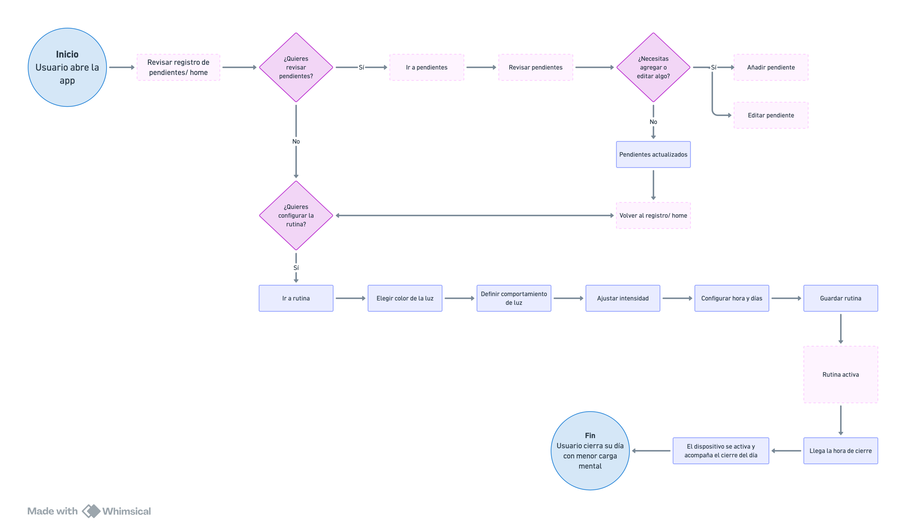

# 🌷 Encargo 17: Wireframes del flujo a la estructura
Miércoles 19 - 26 de agosto de 2026

## 🪩 Desarrollo 

### ➜ El diagrama de flujo de la interacción

**La arquitectura principal:** 
Bienvenida ➡️ Conexión bluetooth ➡️ confirmación ➡️ registro

📍 Cada noche tendrá el siguiente flujo:
- Notificación o señal de que el día ya está por terminar.
- Inicio del cierre.
- Escritura del pendiente en la tarjeta.
- Pendientes que se guardan para la mañana del día siguiente.
- Activación del dispositivo en segundo plano.
- Día cerrado.

# ⚙️ Flujo simplificado para el encargo
1. Registrar/ revisar el día ➡️ 2. Gestionar pendientes ➡️ 3. Configurar la rutina

Esto corresponde a las tres interacciones que representan el uso cotidiano y el propósito del sistema.

## 📌 Wireframe 1 | Registro/ ver el día

Esta pantalla funciona como punto de entrada y orientación. Prioriza el calendario para que el usuario acceda de manera rápida a sus indicadores. Los pendientes aparecen como una vista previa, permitiendo acceder a ellos de una manera rápida. El estado del dispositivo aparece visible de forma secundaria.

- **Objetivos del usuario**: comprender rápidamente cómo ha sido su continuidad reciente y qué tiene pendiente para hoy.
- **Información necesaria**: estado del dispositivo, calendario mensual, días registrados, racha, progreso del mes y cantidad de pendientes.
- **Acción esperada**: revisar su estado y decidir si quiere entrar a sus pendientes o configurar su rutina.
- **Orden de lectura**: estado del dispositivo ➡️ calendario ➡️ indicadores resumidos (dashboard) ➡️ pendientes de hoy ➡️ navegación

Si algo no funciona correctamente, se usarían mensajes breves y funcionales, por ejemplo: Umbral desconectado, un pop up.

## 📌 Wireframe 2 | Gestión de pendientes 

La pantalla organiza los pendientes como tarjetas individuales para favorecer una revisión de uno en uno, en lugar de presentar una lista extensa. El carrusel refuerza la idea de archivo y permite externalizar tareas sin convertir la aplicación en un gestor de productividad complejo. Las acciones principales está asociados directamente a cada tarjeta y el botón de editar se encuentra accesible en caso de que quiera modificar algo escrito.

- **Objetivos del usuario**: externalizar aquello que aún tiene en mente para no necesitar resolverlo antes de cerrar el día.
- **Información necesaria**: cantidad de pendientes, nombres de cada tarea, estado y momento al que queda asociada.
- **Acción esperada**: recorrer las tarjetas, marcar una tipo lista, editarla o añadir un nuevo pendiente.
- **Orden de lectura**: cantidad de pendientes ➡️ tarjeta principal, la que corresponde al día ➡️ estado ➡️ acciones ➡️ botón para editar.

## 📌 Wireframe 3 | Configurar rutina

Esta pantalla configura necesaria para que el usuario adopte el dispositivo a su rutina sin navegar entre múltiples menús. La previsualización aparece primero porque permite comprender inmediatamente el efecto de los ajustes. Después se organizan las decisiones desde lo visual a lo temporal, como la luz, la intensidad, el horario y los días. Así la aplicación prepara la experiencia mientras que el dispositivo físico mantiene el protagonismo durante el cierre nocturno.

- **Objetivos del usuario**: definir cómo y cuándo el dispositivo físico acompañará su cierre nocturno.
- **Información necesaria**: estado de conexión, previsualización de luz, color, comportamiento, intensidad, hora de inicio, días activos y estado de la rutina.
- **Acción esperada**: ajustar la experiencia lumínica y establecer el horario en que la rutina se activará.
- **Orden de lectura**: estado del dispositivo ➡️ previsualización ➡️ características de la luz ➡️ horarios ➡️ días ➡️ activación.

**Entonces...**
El usuario primero comprende su día, luego externaliza aquello que queda abierto y finalmente prepara las condiciones para cerrarlo.

### 🔮 Diagrama de flujo App Umbral Nocturno

  
